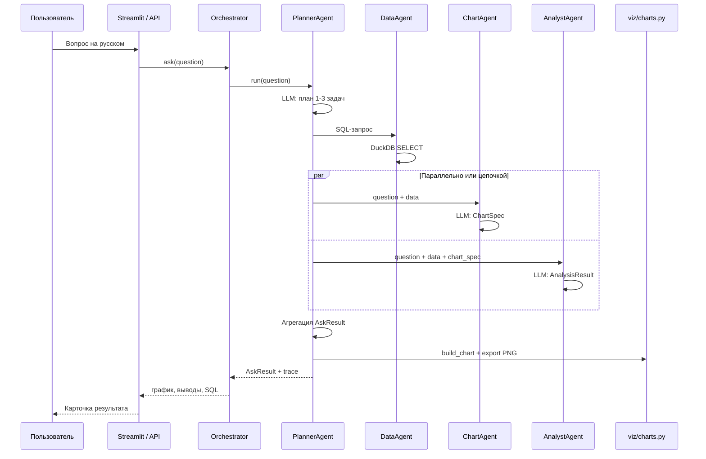
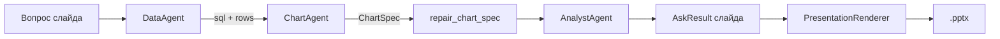

# Прототип BI-аналитики — обзор для руководства

**Проект:** prototip  
**Назначение:** демонстрационная мультиагентная платформа для анализа налоговых данных (синтетические данные РБ, валюта Br)  
**Статус:** прототип, фазы 0–8 выполнены; улучшения оркестрации (волны 1–3) внедрены  
**Репозиторий:** https://github.com/Borisserz/prototip  
**Дата актуализации:** июнь 2026

---

# Часть 1. Простыми словами — что это и зачем

## 1.1. Суть прототипа

**prototip** — это локальная система, в которую сотрудник задаёт вопрос на **русском языке** (как в чате), а система сама:

1. **Понимает**, что нужно сделать (один график, обзорный дашборд или презентацию).
2. **Достаёт цифры** из таблицы с налоговыми данными (через безопасный SQL-запрос).
3. **Строит график** в едином гос-стиле (цвета, шрифты, подписи на русском, валюта Br).
4. **Формулирует выводы** — 3–4 тезиса и ключевой вывод для совещания.
5. При необходимости **собирает дашборд** (несколько графиков + KPI) или **презентацию PowerPoint** (.pptx).

Всё работает **полностью офлайн** на компьютере: без облака, без отправки данных в интернет. «Мозг» системы — локальная языковая модель через **Ollama** (модель `qwen2.5-coder:7b-instruct`).

Это **не** готовая промышленная система и **не** официальная отчётность. Это **демонстрационный прототип** для показа идеи: «руководитель задаёт вопрос — получает наглядный ответ с выводами за минуту».

---

## 1.2. Что представляет собой система в целом

Представьте цепочку из четырёх слоёв:

```
┌─────────────────────────────────────────────────────────────┐
│  ИНТЕРФЕЙС                                                  │
│  Веб-страница (Streamlit) или API — куда пишет пользователь │
└───────────────────────────┬─────────────────────────────────┘
                            │ вопрос на русском
                            ▼
┌─────────────────────────────────────────────────────────────┐
│  ОРКЕСТРАТОР                                                │
│  Единая «диспетчерская»: решает, какой сценарий запустить   │
└───────────────────────────┬─────────────────────────────────┘
                            │
                            ▼
┌─────────────────────────────────────────────────────────────┐
│  АГЕНТЫ (специализированные модули с ИИ)                    │
│  Планировщик → Данные → График → Аналитик → Дашборд / Слайды│
└───────────────────────────┬─────────────────────────────────┘
                            │
                            ▼
┌─────────────────────────────────────────────────────────────┐
│  ДАННЫЕ И ВИЗУАЛИЗАЦИЯ                                      │
│  Таблица CSV + DuckDB (SQL) → Plotly-графики → PNG / PPTX   │
└─────────────────────────────────────────────────────────────┘
```

**Интерфейс** — то, что видит пользователь: четыре вкладки (вопрос, дашборд, презентация, «мой дашборд»), режим «для руководства» (только график и выводы) и «для аналитика» (с SQL и техническими деталями).

**Оркестратор** — одна точка входа. Он не «думает» сам, а направляет запрос к нужному сценарию.

**Агенты** — отдельные «роли» с узкими задачами. Каждый агент вызывает языковую модель строго по шаблону (JSON-схема), чтобы ответ был предсказуемым и проверяемым.

**Данные и визуализация** — синтетическая таблица `data/sample.csv` (420 строк, 7 регионов РБ, 5 видов налогов, 12 месяцев 2024 года). Графики рисует не модель, а проверенный код — единый стиль для всех слайдов и отчётов.

---

## 1.3. Типичные сценарии для руководства

| Сценарий | Пример вопроса | Что получает пользователь |
|----------|----------------|---------------------------|
| **Быстрый ответ** | «Какая задолженность по регионам?» | Один график (горизонтальная диаграмма топа) + текстовые выводы |
| **Динамика** | «Динамика начислений в г. Минск по месяцам» | Линейный график + вывод о тренде |
| **Обзор** | «Дай сводку по налогам по регионам» | Дашборд: KPI-карточки + 3–5 связанных графиков |
| **Доклад** | «Сделай презентацию по задолженности» | Файл .pptx: титул, обзор, слайды с графиками, выводы, рекомендации |
| **Демо без ИИ** | Запуск `scripts/generate_leadership_showcase.py` | Готовое портфолио: 12 типов графиков + 4 презентации в папке `showcase/` |

---

## 1.4. Ключевые преимущества прототипа

- **Русский язык** — вопросы, подписи графиков, выводы, презентации.
- **Единый визуальный стиль** — гос-оформление (#003366, Arial, валюта Br, палитра Okabe-Ito).
- **Прозрачность для аналитика** — можно увидеть SQL-запрос и шаги ИИ («что было сделано»).
- **Безопасность данных** — всё локально; SQL только на чтение, с лимитом строк.
- **Проверяемость** — 146 автоматических тестов + живой сквозной прогон с Ollama.
- **Демо-портфолио** — готовые материалы для совещания без ожидания генерации.

---

## 1.5. Ограничения (честно)

| Ограничение | Пояснение |
|-------------|-----------|
| Синтетические данные | Не реальная налоговая база; цифры для демонстрации логики |
| Одна таблица CSV | Нет подключения к промышленной СУБД, ETL, справочникам |
| Локальная модель 7B | Качество планов и SQL зависит от формулировки вопроса |
| Время ответа | Полный цикл с ИИ — от ~30 секунд до нескольких минут |
| Нет авторизации | Прототип без учётных записей и разграничения доступа |
| Нет фоновых задач API | Долгие операции блокируют запрос (волна 4 — в планах) |

---

## 1.6. Как запустить демонстрацию

```bash
# 1. Установка (один раз)
git clone https://github.com/Borisserz/prototip.git && cd prototip
python -m venv .venv && source .venv/bin/activate
pip install -r requirements.txt
ollama pull qwen2.5-coder:7b-instruct

# 2. Интерфейс для совещания
streamlit run ui/streamlit_app.py
# → http://localhost:8501 , режим «Для руководства»

# 3. Или готовое портфолио без ожидания ИИ
python scripts/generate_leadership_showcase.py
# → папка showcase/
```

---

# Часть 2. Полное техническое описание — как всё устроено

## 2.1. Стек технологий

| Компонент | Технология | Роль |
|-----------|------------|------|
| Язык | Python 3.11+ | Вся логика |
| LLM | Ollama + `qwen2.5-coder:7b-instruct` | Планы, SQL, графики, тексты |
| Контракты | Pydantic v2 | Строгие JSON-схемы между модулями |
| Данные | pandas + DuckDB | CSV в памяти, только SELECT |
| Графики | Plotly + Kaleido | 12 типов, экспорт PNG |
| Презентации | python-pptx | Сборка .pptx |
| UI | Streamlit | 4 вкладки, drill-down, pinned dashboard |
| API | FastAPI | `/ask`, `/generate_dashboard`, `/generate_presentation` |
| Качество | pytest + ruff | 146 автотестов (без live), 8 live с Ollama |

---

## 2.2. Данные и «база данных»

### Файл датасета

- **Путь:** `data/sample.csv`
- **Объём:** 420 строк (7 регионов × 5 налогов × 12 месяцев)
- **Генератор:** `data/make_dataset.py` (воспроизводимый seed, сезонность, аномалии)

### Колонки

| Колонка | Тип | Смысл |
|---------|-----|-------|
| `period` | string | Месяц, формат `2024-01` … `2024-12` |
| `region` | string | Регион РБ (7 значений, включая г. Минск) |
| `tax_type` | string | Вид налога (НДС, подоходный, имущественные и др.) |
| `accrued` | float | Начислено, Br |
| `paid` | float | Уплачено, Br |
| `debt` | float | Задолженность, Br |
| `taxpayers` | int | Число налогоплательщиков |
| `penalties` | float | Штрафы и пени, Br |

### Как выполняется SQL

Реальной СУБД нет. **DataAgent** генерирует `SELECT`-запрос; **DuckDB** регистрирует DataFrame как таблицу `df` и выполняет запрос в памяти.

**Защита:**
- только `SELECT` (запрещены INSERT/UPDATE/DELETE/DROP);
- белый список колонок (`app/domain/constants.py`);
- автоматический `LIMIT` (до 500–1000 строк);
- до 3 попыток самокоррекции при ошибке SQL.

---

## 2.3. Архитектура оркестрации

### Orchestrator — единая точка входа

Файл: `app/orchestrator.py`

| Метод | Когда вызывается | Что делает |
|-------|------------------|------------|
| `ask(question)` | Вкладка «Аналитический вопрос», `POST /ask` | Передаёт в **PlannerAgent** |
| `dashboard(question, …)` | Вкладка «Дашборд», `POST /generate_dashboard` | Напрямую **DashboardAgent** |
| `presentation(questions, …)` | Вкладка «Презентация», `POST /generate_presentation` | Напрямую **PresentationAgent** |

Каждый запрос получает **correlation_id** — сквозной идентификатор для логов (`out/runs/run_*.jsonl`).

### AgentExecutor и фабрика

Файлы: `app/agents/executor.py`, `app/agents/factory.py`

- **AgentRegistry** — реестр агентов по имени.
- **AgentExecutor.run(agent_name, request)** — единый способ вызова.
- **get_planner()** — singleton PlannerAgent (один экземпляр на всё приложение, общий LRU-кэш).
- **get_executor(include_planner=False)** — для вложенных вызовов (дашборд, презентация) без рекурсии планировщика.

---

## 2.4. Агенты — роли, входы, выходы

### Сводная таблица

| Агент | Файл | Вход | Выход | LLM-вызов |
|-------|------|------|-------|------------|
| **PlannerAgent** | `planner_agent.py` | Вопрос | AskResult / DashboardResult / PresentationResult | План 1–3 задач + self-correction |
| **DataAgent** | `data_agent.py` | Вопрос (+ drilldown) | SqlResult: sql + data | SQL (structured) |
| **ChartAgent** | `chart_agent.py` | Вопрос + data | ChartAgentResult: ChartSpec | ChartSpec (structured) |
| **AnalystAgent** | `analyst_agent.py` | Вопрос + data (+ chart_spec) | AnalysisResult | Инсайты (structured) |
| **DashboardAgent** | `dashboard_agent.py` | DashboardRequest | DashboardResult | Композиция дашборда |
| **PresentationAgent** | `presentation_agent.py` | Список вопросов | PresentationResult (.pptx) | DeckNarrative |

### PlannerAgent — «диспетчер с планом»

1. **Генерирует план** из 1–3 задач (LLM + промпт `PLAN_GENERATION_PROMPT`).
2. **Валидирует** план (известные агенты, нет циклов, порядок зависимостей).
3. **Оценивает качество** — штрафует лишние шаги; для широких вопросов предпочитает `dashboard_agent` / `presentation_agent`.
4. **Self-correction** — при низком качестве просит модель исправить план.
5. **Выполняет DAG** — параллельные «волны» (ThreadPoolExecutor), передаёт `data` / `source_sql` / `chart_spec` по `depends_on`.
6. **Пропускает зависимые задачи**, если родитель упал (`success=False`).
7. **Агрегирует** результаты в `AskResult` с **честным** `success` (не «успех» при пустых данных).
8. **Кэширует** успешные ответы (LRU, ключ = вопрос + drilldown + mtime CSV).

**Типовые планы:**

```
Широкий обзор     → 1 задача: dashboard_agent
Один график       → 2 задачи: data_agent → chart_agent
График + выводы   → 3 задачи: data → chart → analyst (Diamond)
Презентация       → 1 задача: presentation_agent
```

### DataAgent — Text-to-SQL

- Промпт содержит **FEW_SHOT** с примерами хороших запросов на русском.
- Правило года: `period LIKE '2024-%'`, не `period = '2024'`.
- Drill-down фильтры из UI добавляются в `WHERE`.
- При ошибке DuckDB — повтор с текстом ошибки в промпте (до 3 раз).

### ChartAgent — выбор визуализации

- На входе: вопрос + таблица данных + **профиль данных** (`app/chart_data_profile.py`).
- Промпт **FEW_SHOT_CHART** с правилами: время → `line`, топ → `horizontal_bar`, доли → `donut`, и т.д.
- Модель возвращает **ChartSpec** (не код графика).
- Пост-обработка: `normalize_chart_spec` + `repair_chart_spec` (`app/chart_repair.py`).
- **Retry до 3 попыток** при ошибке LLM.

### AnalystAgent — текстовые выводы

- Получает **профиль + стратифицированную выборку** данных (`app/data_sampling.py`), не только первые 8 строк.
- При наличии `chart_spec` — обязательная отсылка к типу графика в выводах.
- Поля результата: `insights` (3–4), `key_conclusion`, `anomaly_or_trend`, `follow_up_questions`, `data_explanation`.
- При сбое LLM: `success=False`, `degraded=True` (честный статус, не «всё хорошо»).

### DashboardAgent — комплексный обзор

Внутренний пайплайн:
1. DataAgent (если данные не переданы).
2. AnalystAgent (инсайты, с graceful fallback).
3. Один LLM-вызов для композиции: title, summary, KPI, список ChartSpec, layout.
4. Для каждого графика — вызов ChartAgent или repair готовых spec.
5. Детерминированные KPI (`app/kpi_utils.py`).

### PresentationAgent — презентация .pptx

**Не вызывает PlannerAgent** на каждый вопрос (исправлено в волне 1–3).

Пайплайн:
1. Нормализация и обрезка списка вопросов под `num_slides`.
2. Для каждого вопроса — **slide pipeline** (`app/slide_pipeline.py`): data → chart → analyst.
3. LLM формирует **DeckNarrative** (обзор, темы, выводы, рекомендации).
4. Экспорт PNG графиков (Plotly/Kaleido).
5. **PresentationRenderer** (`app/presentation_renderer.py`) — титул, слайды, gov-badge, KPI, таблицы.

Контекст `presentation_subplan()` запрещает вложенные вызовы `planner_agent` / `presentation_agent`.

---

## 2.5. Схема взаимодействия агентов

### Основной путь: вопрос в чате



### Slide pipeline (презентация)



### Передача контекста между задачами плана

| Поле | Откуда | Куда |
|------|--------|------|
| `data` | SqlResult | chart_agent, analyst_agent |
| `source_sql` | SqlResult | analyst_agent |
| `chart_spec` | ChartAgentResult.spec | analyst_agent (dict) |

---

## 2.6. Слой LLM — единый клиент

Файл: `core/llm.py`

- **Модель:** `OLLAMA_MODEL` или `qwen2.5-coder:7b-instruct`
- **temperature=0** — детерминизм
- **Structured output** — Ollama `format=schema.model_json_schema()`
- **Retry** до 3 попыток (`PROTOTIP_LLM_RETRIES`)
- **JSON-repair** — при ValidationError повторный запрос с текстом ошибки
- Логи: `out/run.log` + stdout

Все агенты вызывают **только** `call_structured(prompt, schema=...)`. Свободный текст не парсится.

---

## 2.7. Графики — принцип spec-first

```
LLM → ChartSpec (JSON) → repair_chart_spec → build_chart(df, spec) → Plotly Figure → PNG/HTML
```

**12 типов:** bar, grouped_bar, stacked_bar, line, area, scatter, waterfall, treemap, horizontal_bar, donut, kpi, heatmap.

**Storytelling-поля:** `action_title` (говорящий заголовок), `show_average`, `highlight_category`.

**Стиль** (`viz/style.py`): Arial, #003366, русские подписи осей, Br / млн Br / млрд Br, палитра Okabe-Ito.

Модель **никогда** не генерирует исполняемый код графика — это исключает произвольный код и гарантирует единообразие.

---

## 2.8. Интерфейс Streamlit

Файл: `ui/streamlit_app.py` (~2500 строк)

| Вкладка | Оркестратор | Особенности |
|---------|-------------|-------------|
| Аналитический вопрос | `.ask()` | Чат, live-конвейер, trace, drill-down |
| Дашборд | `.dashboard()` | KPI + сетка графиков |
| Презентация | `.presentation()` | Очередь вопросов, prefs типа графика |
| Мой дашборд | session state | Закреплённые графики, compare mode |

**Режим «Для руководства»** — скрыты SQL, trace, редактор; видны график, KPI, выводы.

**Drill-down** — клик по элементу графика → фильтр (region/tax_type/period) → уточняющий вопрос с контекстом.

**Ошибки** — при `success=False` или пустых данных: «Нет данных для отображения», без ложного «Успешно».

---

## 2.9. API FastAPI

| Endpoint | Тело запроса | Ответ |
|----------|--------------|-------|
| `GET /health` | — | status, version |
| `POST /ask` | `{question, drilldown?}` | AskResult (JSON) |
| `POST /generate_dashboard` | DashboardRequest | DashboardResult |
| `POST /generate_presentation` | PresentationRequest | PresentationResult |

Запуск: `uvicorn app.main:app --reload` → Swagger на `/docs`.

---

## 2.10. Логирование и наблюдаемость

| Артефакт | Содержание |
|----------|------------|
| `out/run.log` | Текстовые логи агентов `[DataAgent]`, `[PlannerAgent]`… |
| `out/runs/run_{cid}.jsonl` | Структурированные события с correlation_id |
| `PlannerTrace` | План, шаги, agent_calls — для UI «Что было сделано» |
| `emit_pipeline_stage` | Live-статусы конвейера в Streamlit |

---

## 2.11. Тестирование и результаты финальной проверки (июнь 2026)

### Автоматические тесты

| Прогон | Результат |
|--------|-----------|
| `pytest -m "not live"` | **146 passed** (~68 с) |
| `pytest tests/test_e2e.py -m live` | **1 passed** (~78 с, реальный Ollama) |
| Интеграция: orchestrator, API, planner parallel, agent waves | **23 passed** |
| API `/health` | `status: ok` |

### Что проверяют ключевые тесты

- **test_e2e** — полный `Orchestrator.ask()` без моков: SQL, данные, ≥3 инсайта, PNG > 0 байт.
- **test_agent_waves** — честный success, пропуск зависимостей, slide pipeline, degraded fallback.
- **test_factory_and_planner_parallel** — V-граф и Diamond, параллельное выполнение.
- **test_presentation** — сборка .pptx, slide pipeline без nested Planner.

### Выводы глубокого анализа

**Работает стабильно:**
- Совместная работа Planner → Data → Chart → Analyst → рендер PNG.
- Singleton PlannerAgent и общий кэш.
- Presentation через slide pipeline (без N× Planner).
- Честная агрегация `success` при ошибках в цепочке.
- Live e2e с Ollama на MacBook M4.

**Исправлено недавно (волны 1–3):**
- Deadlock в DAG (Lock → RLock).
- Ложный `success=True` при пустых данных / сбое аналитика.
- Дублирование PlannerAgent в presentation.
- Retry ChartAgent и core/llm.

**Известные ограничения / бэклог:**
- `streamlit_app.py` — монолит (~2500 строк), рефакторинг в планах.
- Ruff: ~20 стилистических замечаний (не блокируют тесты).
- Нет async Job API / SSE для долгих операций (волна 4).
- DataAgent при ошибке бросает исключение, а не всегда возвращает `SqlResult(success=False)` — для UI это обрабатывается, но контракт не идеален.

---

## 2.12. Структура репозитория (ключевые пути)

```
prototip/
├── app/
│   ├── orchestrator.py       # Фасад
│   ├── agents/               # Все агенты + executor + factory
│   ├── slide_pipeline.py     # data→chart→analyst для слайдов
│   ├── agent_context.py      # Защита от рекурсии
│   ├── domain/constants.py   # Колонки, CHART_TYPE_RU
│   ├── data_sampling.py      # Профиль данных для промптов
│   ├── planner_utils.py      # Trace, LRU-кэш
│   ├── chart_repair.py       # Нормализация ChartSpec
│   └── main.py               # FastAPI
├── core/
│   ├── llm.py                # Ollama structured + retry
│   └── models.py             # ChartSpec
├── viz/
│   ├── charts.py             # build_chart (12 типов)
│   └── style.py              # RU/Br стиль
├── ui/streamlit_app.py       # Основной UI
├── data/sample.csv           # Демо-датасет
├── showcase/                 # Офлайн-портфолио
└── tests/                    # 26 файлов, 154 теста всего
```

---

## 2.13. Конфигурация (переменные окружения)

| Переменная | По умолчанию | Назначение |
|------------|--------------|------------|
| `PROTOTIP_OLLAMA_MODEL` | `qwen2.5-coder:7b-instruct` | Модель |
| `PROTOTIP_DATA_PATH` | `data/sample.csv` | Путь к CSV |
| `PROTOTIP_OUT_DIR` | `out/` | PNG, логи, pptx |
| `PROTOTIP_PLANNER_CACHE_SIZE` | `32` | LRU-кэш планировщика |
| `PROTOTIP_LLM_RETRIES` | `3` | Повторы LLM |
| `PROTOTIP_PIPELINE_TIMEOUT` | `600` | Таймаут UI, сек |

---

## 2.14. Сравнение с Epsilon Metrics (статья о AI-агентах в BI)

Подробная таблица сходства с [публикацией Epsilon Metrics](https://blogs.epsilonmetrics.ru/generativnye-ai-agenty-i-llm-v-bi/) (без учёта RAG):  
**[SRAVNENIE_S_EPSILON_METRICS.md](SRAVNENIE_S_EPSILON_METRICS.md)**

Краткий вывод: по **идее диалогового BI и иерархическим агентам** prototip совпадает с подходом статьи на **~70–80%**; по **корпоративной инфраструктуре данных** — это упрощённый демо-прототип, а не аналог Epsilon Workspace.

---

## 2.15. Связанная документация

| Документ | Аудитория |
|----------|-----------|
| [README.md](README.md) | Быстрый старт, обзор |
| **[SRAVNENIE_S_EPSILON_METRICS.md](SRAVNENIE_S_EPSILON_METRICS.md)** | **Сравнение со статьёй Epsilon Metrics** |
| [PROJECT_SPEC.md](PROJECT_SPEC.md) | Техническое задание, фазы |
| [AGENTS.md](AGENTS.md) | Правила разработки |
| [tests/DETAILED_TEST_PLAN.md](tests/DETAILED_TEST_PLAN.md) | Стратегия тестирования |
| **OBZOR_DLYA_RUKOVODSTVA.md** | **Этот документ — для руководства** |

---

*Документ подготовлен по результатам финального тестирования и аудита кодовой базы prototip (main, коммит 6b24e16+).*