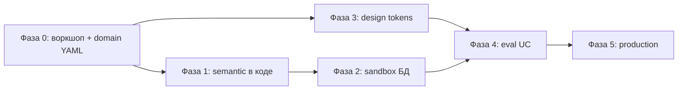

# Пути разработки prototip — альтернативы и решения

**Назначение:** единый справочник для команды — что уже есть, какие варианты развития на каждом слое, что блокируется заказчиком, что можно делать сейчас.  
**Связанные документы:** [DOKUMENTACIYA_INDEX.md](DOKUMENTACIYA_INDEX.md), [PLAN_PRODUKTA.md](PLAN_PRODUKTA.md), [SRAVNENIE_S_EPSILON_METRICS.md](SRAVNENIE_S_EPSILON_METRICS.md)  
**Дата:** июнь 2026

---

# Часть 1. Где мы сейчас

## 1.1. Сводка «сделано / не сделано»

| Компонент | Статус | Где в коде / доках | Зачем важно для продукта |
|-----------|--------|-------------------|--------------------------|
| PlannerAgent + DAG | ✅ | `app/agents/planner_agent.py` | Маршрутизация сложных запросов |
| DataAgent (Text-to-SQL) | ✅ | `app/agents/data_agent.py` | Ядро BI-диалога |
| ChartAgent (ChartSpec) | ✅ | `app/agents/chart_agent.py`, `viz/charts.py` | Предсказуемый визуал |
| AnalystAgent | ✅ | `app/agents/analyst_agent.py` | Выводы для руководства |
| DashboardAgent | ✅ | `app/agents/dashboard_agent.py` | Мультиграфик в режиме дашборда |
| PresentationAgent + slide pipeline | ✅ | `app/slide_pipeline.py` | PPTX без nested Planner |
| Streamlit UI (4 вкладки) | ✅ | `ui/streamlit_app.py` | Основной UX |
| FastAPI sync | ✅ | `app/main.py` | API без фоновых job |
| Demo-данные DuckDB+CSV | ✅ | `data/sample.csv` | Демо, тесты |
| Константы схемы | 🟡 | `app/domain/constants.py` | 8 колонок — не масштабируется |
| Semantic YAML layer | 🟡 | `domain/*.yaml` (скелеты) | Целевой формат, не в runtime |
| Eval-набор вопросов | ❌ | — | Нет `tests/eval/golden_questions.yaml` |
| `scripts/run_eval.py` | ❌ | — | Нет автоматического отчёта качества |
| Job API + SSE | ❌ | бэклог волна 4 | Долгие запросы блокируют UI |
| Мультиграфик в чате | ❌ | только DashboardAgent | `AskResult` — один график |
| Реальная БД | ❌ | — | Нужен sandbox заказчика |
| Auth / RLS | ❌ | — | Production |
| Design tokens YAML | ❌ | хардкод `viz/style.py` | Нужен брендбук |
| Поиск legacy-отчётов | ❌ | — | Опционально (фаза 6) |

**Итог:** основной путь прототипа **завершён**. Дальнейшая работа — либо **укрепление demo** без заказчика, либо **переход к продукту** после материалов из [PLAN_PRODUKTA.md](PLAN_PRODUKTA.md) часть A.

---

# Часть 2. Матрица альтернатив по слоям

Для каждого слоя: варианты → плюсы/минусы → **рекомендация для prototip**.

---

## 2.1. Слой знаний о данных

| Вариант | Описание | Плюсы | Минусы | Рекомендация |
|---------|----------|-------|--------|--------------|
| **A. Только промпт + FEW_SHOT** | Схема и примеры в строках Python | Быстро, работает на 1 таблице | Не масштабируется, дублирование | ✅ **Сейчас** (demo) |
| **B. Semantic YAML в git** | `schema_registry`, `metrics_catalog` | Версионируется, тестируется, без RAG | Нужна дисциплина аналитиков | ✅ **Целевой путь продукта** |
| **C. RAG по документации** | Векторный поиск по Confluence/PDF | Гибко при хаотичных метаданных | Сложность, галлюцинации, не в scope | ❌ Не используем (см. AGENTS.md) |
| **D. Гибрид B+C** | YAML для метрик + RAG для справки | Полнота | Дорого в сопровождении | 🟡 Только если заказчик настаивает |

**Решение:** при переходе к продукту — **вариант B** ([domain/](domain/) → loader в фазе 1 PLAN_PRODUKTA). RAG не планируем.

---

## 2.2. Text-to-SQL

| Вариант | Когда подходит | Риски | Рекомендация |
|---------|----------------|-------|--------------|
| **Одна таблица + whitelist** | Demo, плоские витрины | Неверные JOIN | ✅ Текущий demo |
| **Schema registry + JOIN rules** | 5–20 таблиц, ERD известен | Сложные планы LLM | ✅ Фаза 1–2 продукта |
| **Metric-aware SQL** | Бизнес-метрики формализованы | Нужен metrics_catalog | ✅ Обязательно с заказчиком |
| **SQL-шаблоны без LLM** | Фиксированные отчёты | Нет ad-hoc | 🟡 Дополнение, не замена |

**Эволюция (как в статье Epsilon):** v1 одна таблица → v2 JOIN + guard → v3 метрики из каталога. Подробнее: [SRAVNENIE_S_EPSILON_METRICS.md](SRAVNENIE_S_EPSILON_METRICS.md) §2.3.

---

## 2.3. Графики и визуализация

| Вариант | Плюсы | Минусы | Рекомендация |
|---------|-------|--------|--------------|
| **ChartSpec + детерминированный рендер** | Тестируемо, единый стиль, без exec-кода | Нужно расширять типы вручную | ✅ **Зафиксировано** — не менять |
| **LLM генерирует Python/Plotly** | Гибкость | Непредсказуемо, XSS/безопасность | ❌ Запрещено (AGENTS.md) |
| **Embed Power BI / Looker** | Корпоративный вид | Зависимость от лицензий, не NL | 🟡 Интеграция «после», не ядро |
| **Chart playbook YAML** | Меньше ошибок типа графика | Нужно заполнить с аналитиками | ✅ Фаза 3–4 |

---

## 2.4. Мультиграфик в ответе чата

| Вариант | Как работает | Когда выбирать |
|---------|--------------|----------------|
| **Только DashboardAgent** | Отдельная вкладка / явный запрос дашборда | ✅ **Сейчас** — уже работает |
| **`AskResult.charts[]`** | Planner ставит N chart_task, UI — grid | Нужен «несколько графиков в одном ответе чата» |
| **Composer-агент** | LLM решает число и layout | Максимальная гибкость, сложнее тесты |
| **Шаблон по UC** | «Еженедельный обзор» → фиксированный layout | Предсказуемость для руководства |

**Рекомендация:** для пилота — **DashboardAgent + templates**; для чата — **`AskResult.charts[]`** (PLAN_PRODUKTA F.2) после стабилизации eval.

---

## 2.5. UI

| Вариант | Плюсы | Минусы | Рекомендация |
|---------|-------|--------|--------------|
| **Streamlit (текущий)** | Быстрая разработка, один репозиторий | ~2500 строк в одном файле, лимиты UX | ✅ До пилота |
| **React/Vue SPA + FastAPI** | Полный контроль UX, SSE | 2 кодовые базы, дольше | 🟡 Фаза 5 или при требовании заказчика |
| **Streamlit + вынесенные модули** | Компромисс | Всё ещё Streamlit | ✅ Следующий шаг рефактора UI |

**Решение:** не переписывать на React до **подтверждённого пилота** на Streamlit. API уже отделён — SPA возможна позже без смены агентов.

---

## 2.6. Оркестрация и долгие запросы

| Вариант | Плюсы | Минусы | Рекомендация |
|---------|-------|--------|--------------|
| **Sync HTTP** | Просто | UI зависает на 2–5 мин | ✅ Demo |
| **Job API + SSE/polling** | Прогресс, отмена | Новые эндпоинты, state | ✅ Волна 4 — приоритет для UX |
| **Celery/RQ + Redis** | Масштаб, очереди | Инфраструктура | 🟡 Production (фаза 5) |

**Приоритет без заказчика:** Job API+SSE **выше**, чем React, если жалуются на «зависание» при презентациях.

---

## 2.7. LLM

| Вариант | Плюсы | Минусы | Рекомендация |
|---------|-------|--------|--------------|
| **Ollama 7B local** | Офлайн, M4, быстрый цикл | Ошибки на сложном SQL | ✅ Default |
| **Ollama 14B+** | Лучше планы/SQL | RAM, медленнее | 🟡 A/B через `PROTOTIP_OLLAMA_MODEL` |
| **Cloud API (GPT/Claude)** | Качество | Данные уходят наружу | 🟡 Только если заказчик разрешит |
| **Fine-tune** | Доменная точность | Данные, MLOps | 🟡 Фаза 6, если 7B не тянет схему |

---

## 2.8. Источник данных

| Вариант | Плюсы | Минусы | Рекомендация |
|---------|-------|--------|--------------|
| **DuckDB + CSV/Parquet** | Локально, тесты | Не production DWH | ✅ Dev + demo |
| **Postgres read-only** | Типично в госсекторе | Нужен доступ | ✅ По умолчанию для фазы 2 |
| **ClickHouse** | Большие объёмы | Другой SQL-диалект | 🟡 Если заказчик на CH |
| **Материализованные витрины** | Скорость, проще SQL | ETL у заказчика | ✅ Рекомендовать заказчику |

**Блокер фазы 2:** sandbox read-only от заказчика (см. [templates/customer_questionnaire.md](templates/customer_questionnaire.md)).

---

## 2.9. Интеграции и enterprise-паритет

| Возможность | Нужна когда | В prototip |
|-------------|-------------|------------|
| Поиск существующих отчётов | Много legacy BI | ❌ Фаза 6 |
| Telegram / Slack / email | UC «прислать руководителю» | ❌ Бэклог AGENTS.md |
| Scheduled reports | Еженедельные дашборды | ❌ Фаза 6 |
| SSO / LDAP | Production | ❌ Фаза 5 |

Сравнение с Epsilon Workspace: [SRAVNENIE_S_EPSILON_METRICS.md](SRAVNENIE_S_EPSILON_METRICS.md).

---

# Часть 3. Три сценария развития (не взаимоисключающие)

## Сценарий 1 — «Укрепление demo» (без заказчика)

**Цель:** улучшить прототип на текущих данных, не меняя домен.

| # | Задача | Файлы | Приоритет |
|---|--------|-------|-----------|
| 1 | Eval-набор + `run_eval.py` | `tests/eval/`, `scripts/` | Высокий |
| 2 | Вынести FEW_SHOT в YAML (без loader) | `domain/sql_examples.yaml` | Средний |
| 3 | Job API + SSE (волна 4) | `app/main.py`, UI | Высокий при жалобах на UX |
| 4 | `design/tokens.yaml` (gov как default) | `viz/style.py` | Средний |
| 5 | Разбить `streamlit_app.py` | `ui/components/` | Средний |
| 6 | `AskResult.charts[]` | schemas, planner, UI | Низкий до eval |

Детали: [PLAN_PRODUKTA.md](PLAN_PRODUKTA.md) часть F.

---

## Сценарий 2 — «Продукт с заказчиком» (основной бизнес-путь)

**Триггер:** получен минимум из части A PLAN_PRODUKTA (DDL + glossary + 10 SQL + sandbox + UC).

| Фаза | Срок | Результат |
|------|------|-----------|
| 0 Сбор | 1–2 нед | Заполненный `domain/` v2, golden questions |
| 1 Semantic в коде | 2–3 нед | Loader, sql_guard, metric-aware DataAgent |
| 2 Real DB | 2–4 нед | Connector, RLS, audit |
| 3 Design | 2–3 нед | tokens, dashboard templates |
| 4 Use cases + eval | 2–3 нед | ≥85% golden questions |
| 5 Production | 4–6 нед | Auth, мониторинг, HA |

**Параллелизация:** после фазы 0 — потоки **1 (данные)** и **3 (дизайн)** параллельно.

Полное описание: [PLAN_PRODUKTA.md](PLAN_PRODUKTA.md) части B–H.

---

## Сценарий 3 — «Enterprise-паритет» (опционально)

**Триггер:** пилот успешен, заказчик хочет функции как у Epsilon Workspace.

- Агент поиска отчётов (если много Power BI / legacy)
- Доставка в мессенджеры
- Scheduled reports
- Fine-tune / prompt lab

Фаза 6 в PLAN_PRODUKTA. Не начинать до завершения сценария 2 MVP.

---

# Часть 4. Блокеры и зависимости

## 4.1. Что без чего не начинать

| Хотим сделать | Блокер | Что запросить |
|---------------|--------|---------------|
| Подключить prod-БД | Нет sandbox | Read-only дамп или VPN к stage |
| Metric-aware SQL | Нет каталога метрик | `metrics_catalog` от аналитиков |
| JOIN по схеме | Нет ERD/DDL | DDL + карта FK |
| Брендовый UI | Нет брендбука | Figma / PDF UI-kit |
| Eval 85% на реальных вопросах | Нет golden set | Топ-20 вопросов дословно |
| RLS | Нет матрицы ролей | Таблица роль → фильтры |
| SSO | Нет IdP | LDAP/AD параметры |

## 4.2. Матрица «что получится с частичными входами»

| Если есть только… | Результат |
|-------------------|-----------|
| Use cases, без БД | Моки, нет реальных цифр |
| БД, без дизайна | Правильные числа, «прототипный» вид |
| Дизайн, без метрик | Красиво, но опасная аналитика |
| БД + UC, без дизайна | **Пилот для аналитиков** |
| БД + дизайн + UC | **Пилот для руководства** |
| Всё + инфра | **Production roadmap** |

(Из [PLAN_PRODUKTA.md](PLAN_PRODUKTA.md) A.5.)

---

# Часть 5. Рекомендуемая последовательность

## 5.1. Пока нет материалов от заказчика

1. Держать прототип в рабочем состоянии (`pytest`, демо showcase).
2. Отправить [templates/customer_questionnaire.md](templates/customer_questionnaire.md).
3. По желанию команды — пункты из **Сценария 1** (eval, wave 4, tokens).
4. **Не писать** production connector и loader без реальной схемы.

## 5.2. После получения материалов (типовой кейс)

1. **Фаза 0** — заполнить [domain/](domain/) с аналитиками заказчика, согласовать 10 golden SQL.
2. **Параллельно:** фаза 1 (код) + фаза 3 (дизайн).
3. **Фаза 2** — connector на sandbox, те же golden questions.
4. **Фаза 4** — eval ≥85%, презентации по топ-5 UC.
5. **Фаза 5** — auth, audit, Job queue в production.

## 5.3. Критерий «готов к пилоту»

См. [PLAN_PRODUKTA.md](PLAN_PRODUKTA.md) часть H (6 пунктов DoD).

---

# Часть 6. Быстрые ответы на частые вопросы

| Вопрос | Ответ |
|--------|-------|
| Основной путь прототипа сделан? | **Да** — фазы 0–8, волны 1–3. |
| Что главное для продукта? | Semantic layer + sandbox БД + UC от заказчика. |
| Нужен ли RAG? | **Нет** — YAML semantic layer (решение зафиксировано). |
| Streamlit или React? | Streamlit до пилота; API готов к SPA позже. |
| Сколько графиков в чате? | Сейчас 1; несколько — через Dashboard или будущий `charts[]`. |
| Параллельность агентов? | Planner DAG, до 4 потоков; слайды — последовательно. |
| Насколько близки к Epsilon? | ~70–75% по идее агентов; ~25% по слою данных. |

---

# Часть 7. Следующие артефакты в репозитории

| Артефакт | Путь | Статус |
|----------|------|--------|
| Вопросник для заказчика | [templates/customer_questionnaire.md](templates/customer_questionnaire.md) | ✅ |
| Карточка use case | [templates/use_case_card.md](templates/use_case_card.md) | ✅ |
| Скелеты semantic layer | [domain/](domain/) | ✅ demo |
| Индекс документации | [DOKUMENTACIYA_INDEX.md](DOKUMENTACIYA_INDEX.md) | ✅ |

---

*Документ обновлять при выборе нового стратегического решения (например, смена СУБД или появление RAG).*