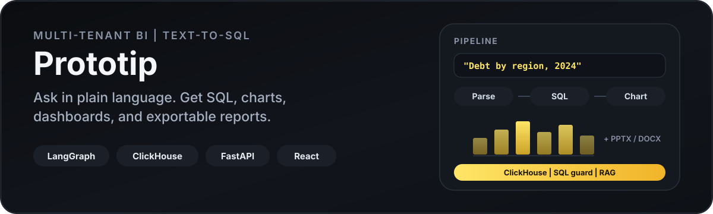

<p align="center">
  
</p>

<p align="center">
  
</p>

**Prototip** is a multi-tenant BI platform: ask in plain language, get guarded Text-to-SQL on **ClickHouse**, charts/dashboards, and exportable PPTX / DOCX / Excel — orchestrated by **LangGraph** agents.

Built for on-prem / isolated tenants (each client gets its own ClickHouse + semantics). LLM backend: **Vertex AI / Gemini** or local **Ollama**.

---

## What it does

| Area | What you get |
| --- | --- |
| **Ask → answer** | NL question → plan → SQL → validate → analyze → visualize |
| **Agents** | LangGraph graph for SQL, charts, dashboards, forecast, docs, reviewer loop |
| **Safety** | SQLGlot-based SQL guard + tenant isolation / RLS injection |
| **Semantics** | MDL + RAG over schema/docs (ClickHouse vector distance) |
| **Ops** | Docker Compose profiles for ETL (Airflow), auth (Keycloak), observability |

---

## Quick start

```bash
git clone https://github.com/Borisserz/prototip.git
cd prototip
cp .env.example .env

docker compose up -d --build
```

| Service | URL |
| --- | --- |
| App | http://localhost:3000 |
| API docs | http://localhost:8000/docs |
| MinIO console | http://localhost:9101 |

Optional profiles:

```bash
docker compose --profile auth up -d
docker compose --profile etl up -d --build
docker compose --profile observability up -d
docker compose --profile ollama up -d
```

Demo tenant DB walkthrough: [`DEMO_GUIDE.md`](DEMO_GUIDE.md) · service ports: [`STARTUP_GUIDE.md`](STARTUP_GUIDE.md)

---

## Repo layout

```text
frontend/   React + Vite + Tailwind
backend/    FastAPI + LangGraph agents + SQL guard
db/         ClickHouse image + init/seed
ops/        Prometheus / Grafana provisioning
demo/       Demo Postgres for client-DB demos
docs/       Architecture
```

---

## Local dev (without full Docker)

```bash
# Backend
cd backend
python -m venv .venv && source .venv/bin/activate
pip install -r requirements.txt
uvicorn app.main:app --reload --port 8000

# Frontend
cd frontend
npm install
npm run dev   # http://localhost:5173
```

Secrets stay out of git: copy `.env.example`, put Vertex creds in `backend/secrets/gcp.json` (see `backend/secrets/README.md`).

---

## Docs

- [`docs/ARCHITECTURE.md`](docs/ARCHITECTURE.md) — full system design (RU)
- [`STARTUP_GUIDE.md`](STARTUP_GUIDE.md) — compose profiles & ports
- [`DEMO_GUIDE.md`](DEMO_GUIDE.md) — demo scenario

---

## License

Portfolio / demonstration project. See repository owners for reuse terms.
